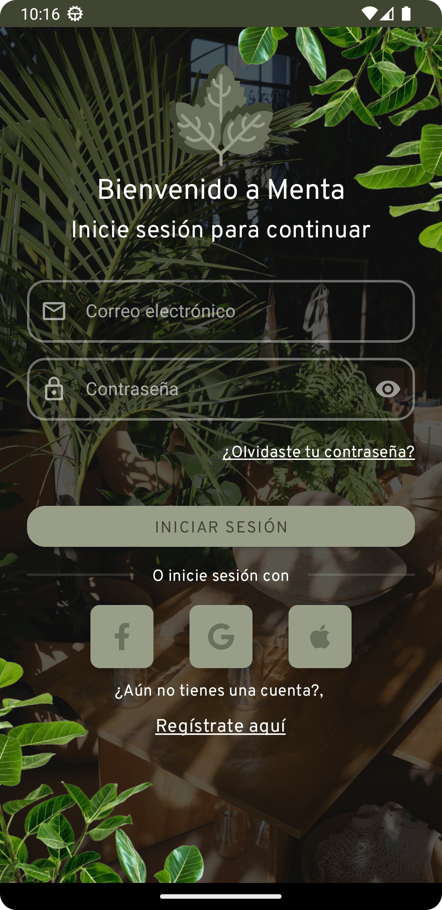
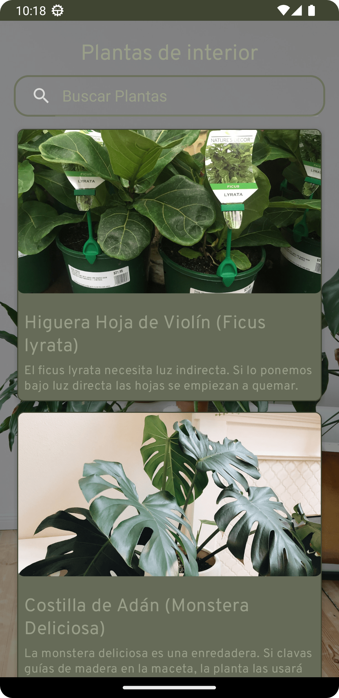
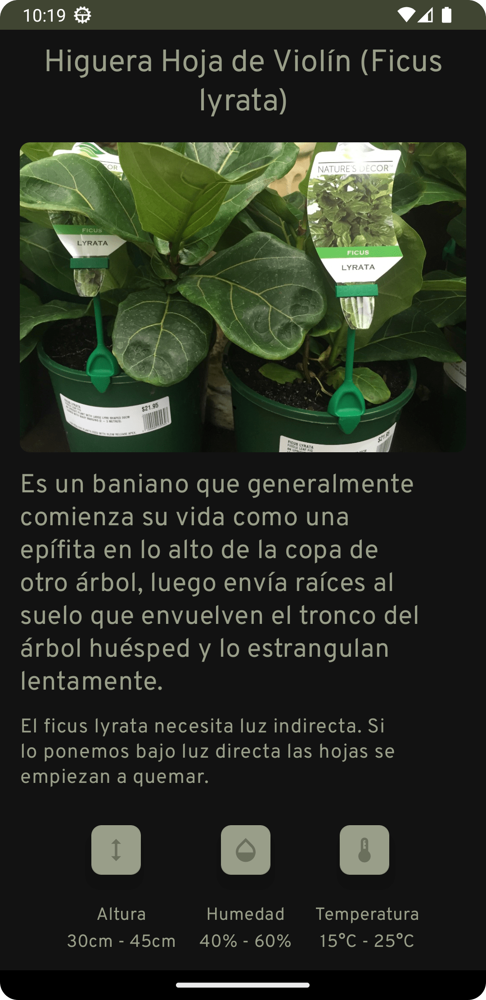

# Menta

Menta es una aplicación móvil que contiene una plantilla de UI/UX para una app de plantas. Esta plantilla se desarrolló en Android Studio con la versión del SDK 33 y se utilizó la librería Material You para el diseño de la aplicación.

## Descripción

La aplicación Menta es solo un demo que contiene las siguientes funciones:

-   Login
-   Signup
-   Recuperar contraseña
-   Menú con tipos de planta
-   Tema light y dark

Es importante mencionar que Menta es solo una plantilla y no tiene mucha funcionalidad, ya que se enfoca principalmente en el diseño de la aplicación.

## Requisitos de sistema

Para utilizar la aplicación Menta, se requiere lo siguiente:

-   Android Studio versión 4.2 o superior
-   SDK de Android versión 33 o superior
-   Librería Material You

## Instalación

Para instalar la aplicación Menta, sigue estos pasos:

1.  Clona el repositorio en tu computadora:

`git clone https://github.com/tu-usuario/Menta.git` 

2.  Abre el proyecto en Android Studio
3.  Haz clic en "Run" para compilar y ejecutar la aplicación en tu dispositivo o emulador

## Cómo usar la aplicación

Después de instalar Menta, puedes probar las diferentes funciones de la aplicación:

1.  Inicia sesión en la aplicación utilizando las credenciales predeterminadas o crea una nueva cuenta
2.  Si olvidaste tu contraseña, puedes recuperarla a través de la función "Recuperar contraseña"
3.  En el menú principal, puedes seleccionar diferentes tipos de plantas para ver su información
4.  También puedes cambiar entre el tema light y dark en la configuración de la aplicación

## Imágenes de demostración

A continuación se muestran algunas imágenes de demostración de la aplicación Menta:

 

 

## Licencia

Menta se distribuye bajo la Licencia MIT. Para más información, consulta el archivo [LICENSE](https://github.com/DaveDeveloper117/Menta/blob/master/LICENSE) en este repositorio.
